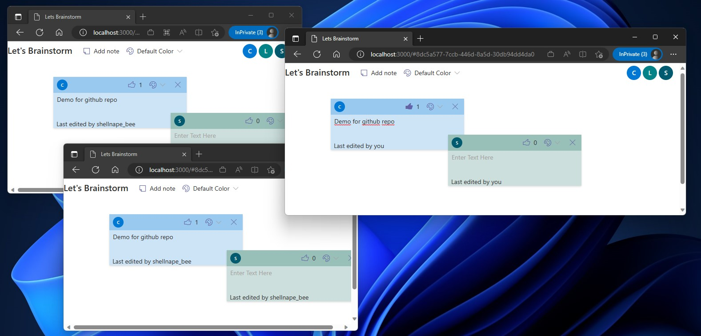

# Fluid Framework and Azure Fluid Relay démos 

To build and run the démo on windows, install [NodeJS](https://nodejs.org/en) runtime and [npm](https://docs.npmjs.com/downloading-and-installing-node-js-and-npm) on your computer.

Demos have been successfully tested and deployed with __nodejs 18.16.0__ and __npm 9.6.7__


### Open SSL error on client app startup
With Node18, if you get an _**ERR_OSSL_EVP_UNSUPPORTED**_ error when starting client apps, as a workaround define the following environment variable : 
```cmd
SET NODE_OPTIONS=--openssl-legacy-provider
```
and restart apps.

### Demo deployment 
All demos using the Azure Fluid Relay service are deployable in a  [Azure Storage - Static Website](https://learn.microsoft.com/en-us/azure/storage/blobs/storage-blob-static-website).
I use the [Azure Storage Explorer](https://azure.microsoft.com/en-us/products/storage/storage-explorer/) app to manage and deploy in my storage account. 

After building the demos you want to deploy, just copy the content of the build result (see each demo for 'where are my build results' details) to the _$web_ storage container in your storage account, and browser to the public 

### Get Azure Fluid Relay credentials 
After provisionning an [Azure Relay service instance](https://learn.microsoft.com/en-us/azure/azure-fluid-relay/how-tos/provision-fluid-azure-portal), go to the 'AccessKey' tab of your instance to retrieve the values to copy in your app (see each demo for 'where to copy' details ) : 

- __Tenant Id__ : unique identifier of you Azure Fluid relay service
- __Primary Key__ or __Secondary Key__ : this is the 'password' allowing an app connecting to your Azure Fluid Relay instance.
- __Service Endpoint__ : the url to connect to your Azure Fluid Relay service instance.

:warning: __These apps are for basic demo purposes only !__
:warning: __Secret key are embedded in the browser JS code__ and can easily be extracted from the browser.  
:warning: __AVOID__ commiting credentials in your git repo.

:white_check_mark: Regenerate both keys EVERY time you finished a public demo to avoid unwanted usage (and extra cost/billing/...) of your Azure services.
:white_check_mark: Implement [Token Provider](https://learn.microsoft.com/en-us/azure/azure-fluid-relay/how-tos/azure-function-token-provider) for secure and/or production deployment.

## ~/FluidHelloWorld
The official FluidFramework HelloWorld : roll dices with a local Fluid router (tinylicious).
_This demo is fully autonomous and does not need azure services_

__How to run the demo :__
Go to the root folder of the repo, then run 
```cmd
cd FluidHelloWorld
npm install
npm run start:server
npm run start:client
```
Browse to http://localhost:8080/ to open a new collaborative session. 

When the location bar show the session ID (ex: http:// localhost:8080/__#67584439-1bcf-4094-a7bb-57e079f21b7c__ ) , you can reuse the full link on other __local__ browser window/tab to demonstrate collaboration between instances of the same apps.


## ~/FluidHelloWorld-Relay
An updated version of the FluidHelloWord app that use your Azure Fluid Relay instance as fluid router.
You need to provision and Azure Fluid Relay instance.
Retrieve your Azure Fluid Relay instance credentials and update __src/app.js__ file : Replace all XXXXXX string with your correct value

```javascript
const serviceConfig = {
    connection: { // All information available in "Access Keys" tabs in your relay's blade in the Azure Portal
        tenantId: "XXXXXX", // ID du tenant Azure FluidRelay
        tokenProvider: new InsecureTokenProvider("XXXXXX"/* Primary/2ry key de l'instance du FluidRelay */ , user),
        endpoint: "https://XXXXXX.fluidrelay.azure.com",  // Endpoint de l'instance du FluidRelay (dépend de la region Azure)
        type: "remote",
    }
};
```

__How to run the demo locally :__
From the root folder of the repo, then run 
```cmd
cd FluidHelloWorld-Relay
npm install
npm run start:client
```
Browse to http://localhost:8080/ to open a new collaborative session relaying thru Azure. 


__How to deploy the demo in Azure__
From the root folder of the repo, then run 
```cmd
cd FluidHelloWorld-Relay
npm install
npm run build
```
Follow __§Demo Deployment__ to deploy the content of the '__dist__' folder in an Azure Storage Static Website.


## ~/brainstorm

This is a advanced demo written using **React** and **TypeScript**. 

It is able to run locally or in the cloud (using Azure Fluid Relay) without any code changes (except for the Azure Credentials, but it can be externalized very easily) : the NPM AzureRelay package can connect locally (without credentials on a tinilicious router) or remotely (on a AzureFluidRelay instance). 

If your want to run it in Azure, you need to provision an Azure Fluid Relay instance. Then, retrieve your Azure Fluid Relay instance credentials and update __src/Config.ts__ file : Replace all XXXXXX string with your correct value

```typescript
const remoteConnectionConfig: AzureRemoteConnectionConfig = {
	type: "remote",
	tenantId: "XXXXXX", // TODO: REPLACE WITH YOUR TENANT ID
	tokenProvider: new InsecureTokenProvider(
		"XXXXXX" /* TODO: REPLACE WITH YOUR PRIMARY/SECONDARY KEY */, 
		userConfig
	),
	endpoint: "https://XXXXXX.fluidrelay.azure.com", // TODO: REPLACE WITH YOUR AZURE ENDPOINT
};
```


__How to run the demo locally :__
From the root folder of the repo, then run 
```cmd
cd brainstorm
npm install
npm run start:server
npm run start
```
Browse to http://localhost:3000/ to open a new collaborative session relaying thru Azure. 

You can open multiple browser/tabs using the same URL (with the #sessionId) to share the same collaboration session.




__How to deploy the demo in Azure__
From the root folder of the repo, then run 
```cmd
cd brainstorm
npm install
npm run build:azure
```
Follow __§Demo Deployment__ to deploy the content (files and subfolders) of the '__build__' folder in an Azure Storage Static Website.


